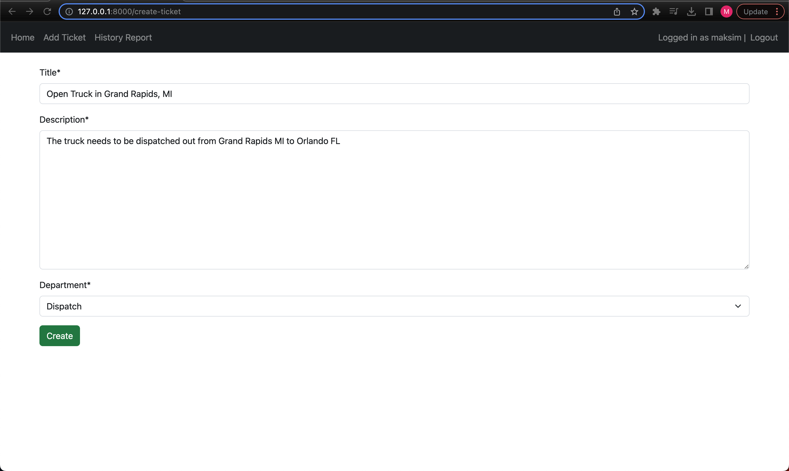
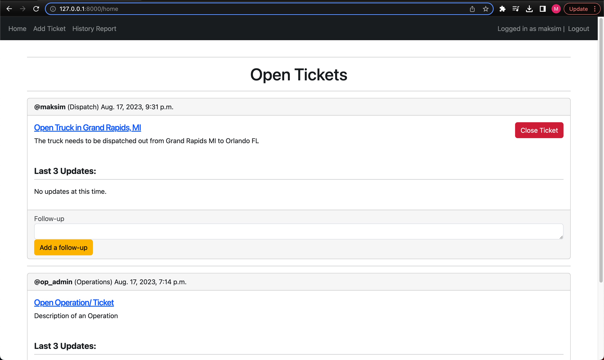
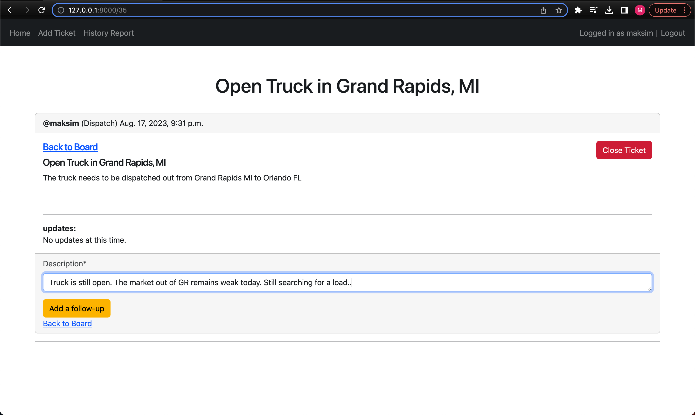
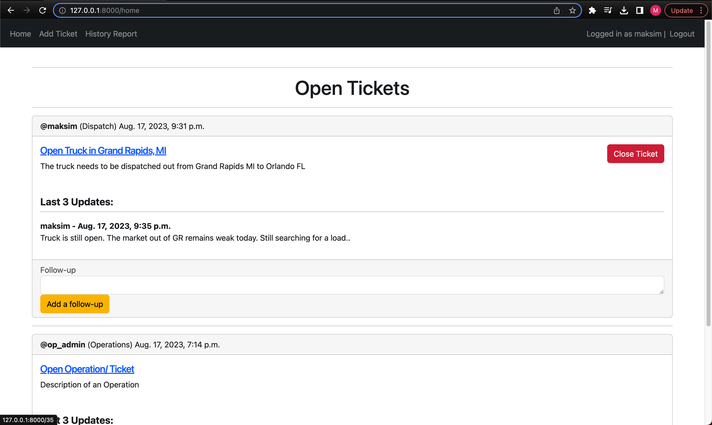
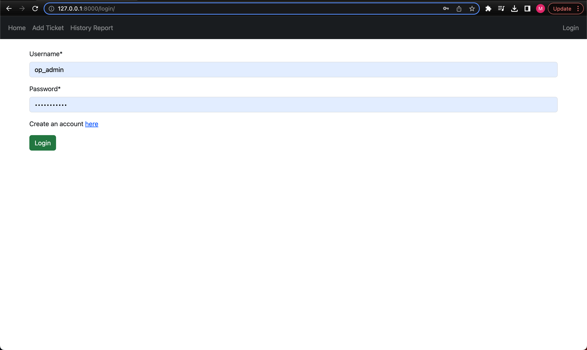
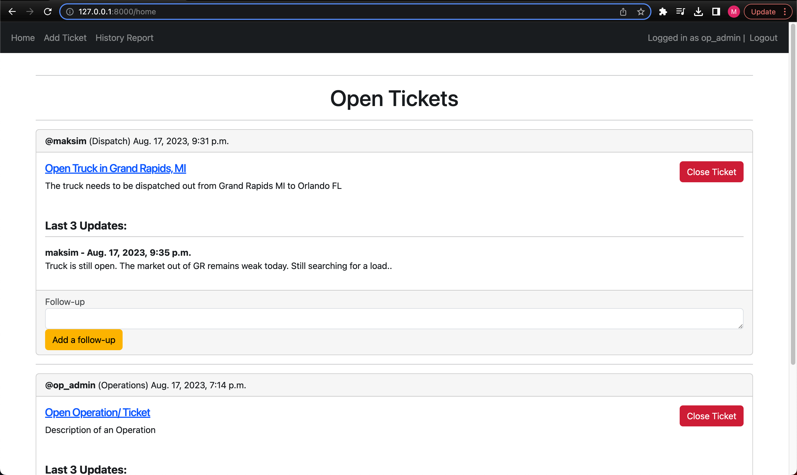
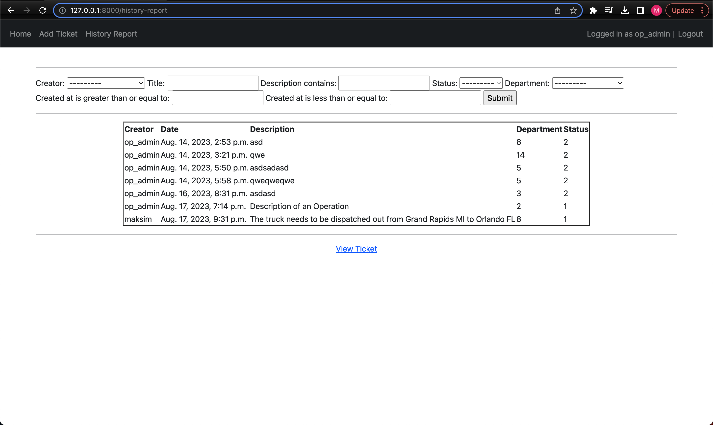
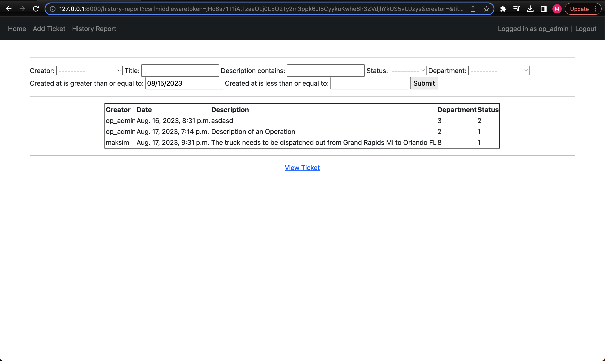
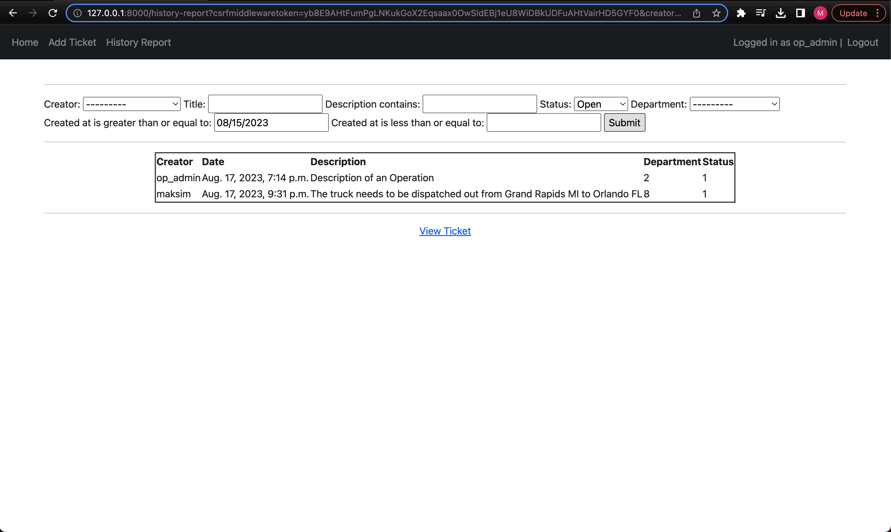

# Log Manager
### Log Manager is a web board that can be used by a start up company to manage and visualize "logs".
### A "log" is a time-stamped documentation of events related to work operations

#### Adding a new log

#### Clicking "Create" button will direct user to the Home page which now reflects the newly created "ticket"

#### Clicking on the "comment" or Follow-up field will dirrect you to an isolated page of the ticket you want to comment on.
#### Type in your message and click Add a follow-up

#### Adding a follow up will direct you back to the Home page where your follow up is posted to the post you commented to.

#### Adding a follow up will direct you back to the Home page where your follow up is posted to the post you commented to.
#### Note that there is no access to deleting "tickets" created by other

#### Logging out will lead to loosing access to the home page because the user must be the part of this organization or a company.

#### After logging in as an admin (op_admin account), user now has an ability to delete or "close" any open "ticket"

#### Admin also has access to the History Report page where all all-time cases are listed in a table

#### Entering a "created at greater than" date will result of filtering out "tickets" created before this date

#### Selecting "open" option in the filter by status field will filter out all closed "tickets" and display only open ones

- 🔭 More functionality and improvements are being worked on. 

